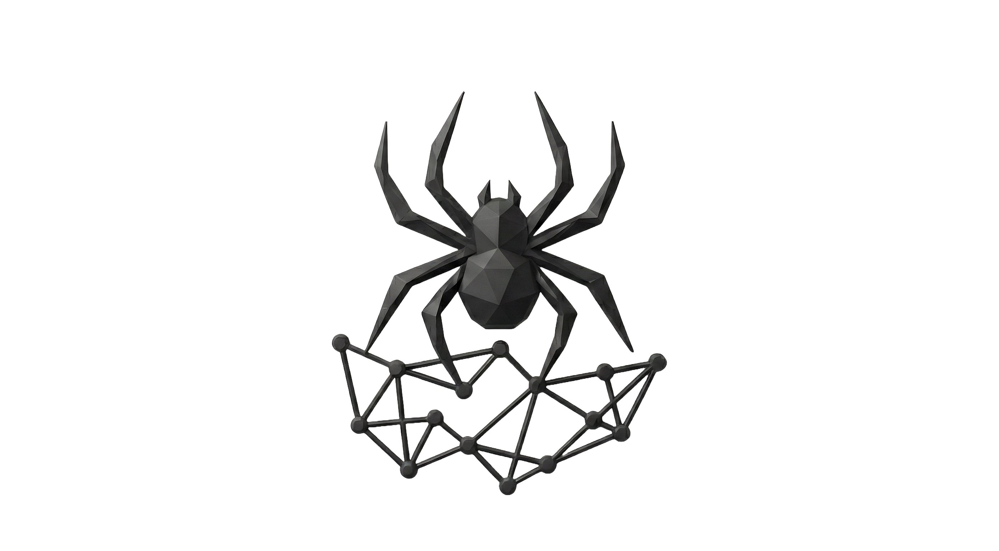

### Spider: Bio-Inspired AI Agent Memory Graph

A context-aware graph database that thinks like a human brain.
Memories form, strengthen, decay and consolidate over time.



##### Status: Active Development

Spider v2 is currently under development. Core features are being implemented. The API and architecture are subject to change.

##### Vision

Spider is a **long-term memory layer for AI agents** that mimics biological memory systems. Unlike traditional vector databases that treat all memories equally, Spider implements memory dynamics inspired by neuroscience:

- **Memories from** when information is added
- **Strong memories** (frequently accessed, high significance) stays alive
- **Weak memories** (rarely used, low importance) decay and get pruned
- **Related memories** automaticlly connect and strenghten each other
- **Knowledge consolidates** over time into higher-level concepts

##### Why Spider?

Most RAG systems treat memory as a static lookup table. Spider treats it as a **living, breathing system** that:

- **Forgets** irrelevant information (reducing noise)
- **Prioritizes** important memories (Bio-Score system)
- **Clusters** related concepts
- **Saves storage** (on-the-fly-embeddings)
- Adapts to access patterns (hot/warm/cold storage tiering)

##### Core-Principles

1. **Bio-Inspired Memory Dynamics**
Every node has a **Bio Score** that determines its *"life force"*:
```
Bio Score = f(frequency, significance, Δtime, gravity)

Where:
    - frequency: number of accesses/retrievals
    - significance: user-assisted improtance
    - gravity: system-assigned weight (constant)
    - time: decay based on last access
(Ebbinghaus curve)
```

**Memory Lifecycle:**
```
High Bio Score -> Hot Storage (RAM) -> Instant access
Medium Score -> Warm Storage (SSD) -> Fast access
Low Score -> Cold storage (Archive) -> Slower, rehydratable
Score <=0 -> Pruned (forgotten) -> Removed
```

2. **LEANN-Style Efficiency**
Inspired by **[LEANN]**(https://github.com/yichuan-w/LEANN)
- **No stored embeddings** - computed on-the-fly from content
- **Hub node caching** - frequently accessed nodes cached in memory
- **Incremental updates** - no re-embedding required

---

##### Design Decisions

###### Why Fixed-Sized Records?
- **O(1) Random Access**: ```offset = HEADER + (id - 1) * record_size```
- **Memory Mapping**: OS handles caching, no manual buffer management
- **Simple Persistence**: Direct memory mapping with periodic flush
- **Predictable Performance**: No variable-length parsing overhead

###### Why Property Graphs Over Pure Vector DB?
- **Rich Relationships**: Capture explicit connections (not just similarity)
- **Queryable Structure**: Filter by labels, traverse by relationship type
- **Temporal Knowledge**: Track when facts became true/false
- **Hybrid Retrieval**: Combine graph traversal + semantic search

###### Why on-the-Fly Embeddings?
- **Efficient Storage**

###### Why Bio-Inspired Decay?
- **Noise Reduction**: Irrelevant memories naturally fade
- **Capacity Management**: Automatic pruning prevents unbounded growth
- **Human-Like**: Matches how biological memory actually works

---

##### License

*To be determined*

---

**Built with ❤️ by [Sujal Nath](https://github.com/nathsujal) for AI agents that remember like humans do.**